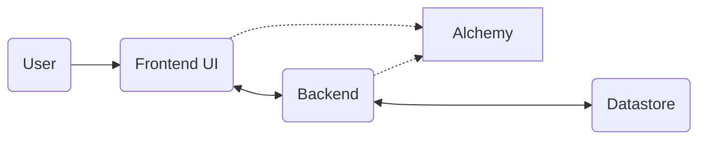
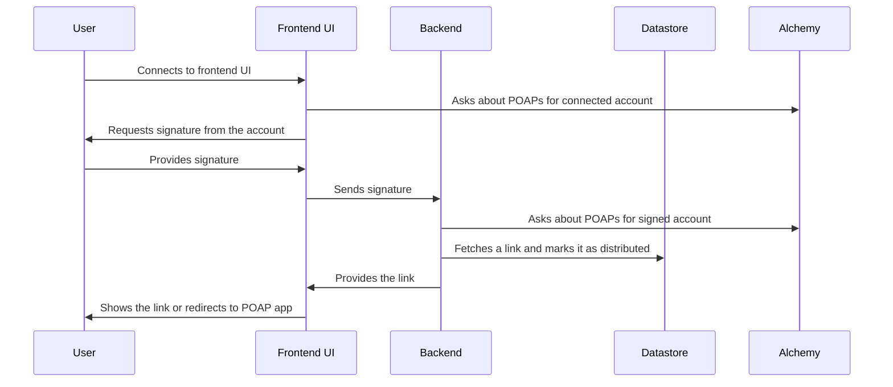

# POAP Central — Proof of POAP

Web app 👉 <https://poapcentral.xyz>

## What is this?

A web app to distribute POAPs to eligible users. Eligibility could be determined by checking what other POAPs an account may have collected – Proof of POAP.

## Local Development

### Installation of Runtimes (macOS)

```bash
# frontend -> bun
brew tap oven-sh/bun
brew install bun

# backend -> dotnet-sdk
brew install --cask dotnet-sdk
```

### Launching the Application

#### Frontend

```bash
# install dependencies
bun install --cwd frontend/

# disable telemetry (optional)
bun run astro telemetry disable

# run application
bun run --cwd frontend/ astro dev
```

#### Backend

```bash
# run application
dotnet watch --project backend/api/
```

## Project Plan (High Level)

### Step 0.5 - Event info

- Frontend fetch event info from backend

### Step 1 – Basics of the Service

- Prove who the owner of the account is by signing a message (what should be signed?)
  - Advanced: Should signature be done using for example SIWE (Sign-In With Ethereum)?
  - Simpler: We could have a simpler structure of signatures as well if the signature is only used to claim a POAP link.
- An administrator should be able to input POAP links to be dispensed
- An administrator of an event should be able to select which POAPs (if any) the account needs to have already received in order to be eligible for this POAP.
- Allow the logged in account to claim a POAP (by link?).
- When a POAP link has been distributed by our service we’ll flag it as distributed so that it cannot be distributed again to any other user. We should also mark which account received which link.
- An account can only receive one distributed POAP link.
  - If the account tries to get the same POAP twice we could show the link that they have already received.

### Step 2 – Proof of POAP

- Look up what POAPs the account owns
  - Check Gnosis Chain (contract: `0x22C1f6050E56d2876009903609a2cC3fEf83B415`) for POAPs that the account has already received.
  - Use Alchemy API to verify POAPs?
- Show apologetic text if the account is not allowed to claim this POAP.
  - Could happen if the account is not eligible for the POAP.
  - Could also be that case that all submitted POAP links have already been distributed.
- Display the POAP or provide a confirmation message to the logged-in account after they have successfully claimed a POAP by link.

## Basic Initial Components

- Frontend UI for users
  - Show link received by backend.
  - Request backend with account’s signature.
- Backend that distributed the links to POAPs
  - Store links in datastore.
  - Update information about links in datastore.
  - Provides an API for the frontend to use.
- Datastore that holds all the links and can store new links (+ metadata about them)

## Service Functionality



1. Frontend asks Alchemy about POAPs for the connected account.
2. Frontend requests a signature from the account.
3. Frontend sends the signature to backend.
4. Backend asks Alchemy about POAPs for the account that signed the message.
5. Backend fetches a link from the datastore and marks it as distributed and provides the link to the frontend.
6. Frontend shows the link (or redirects to POAP app for user to claim).


